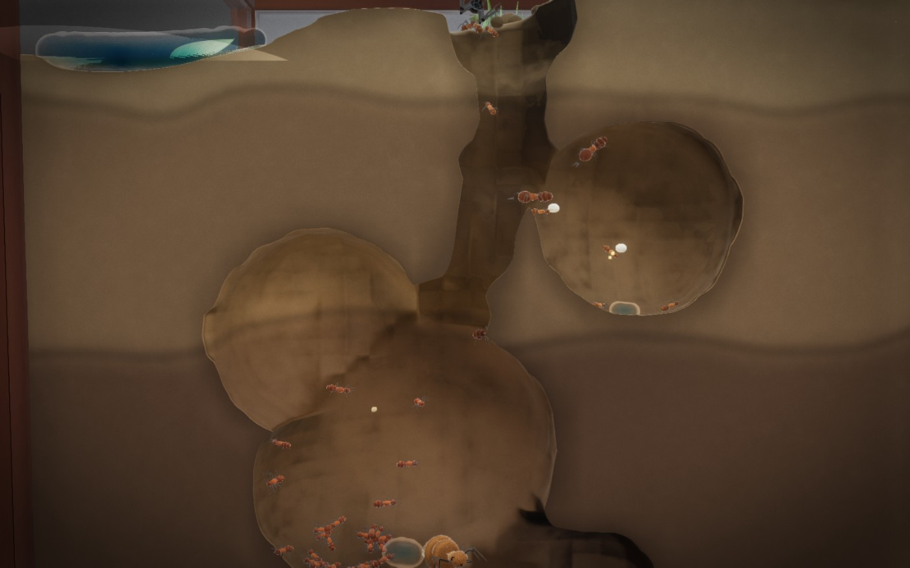
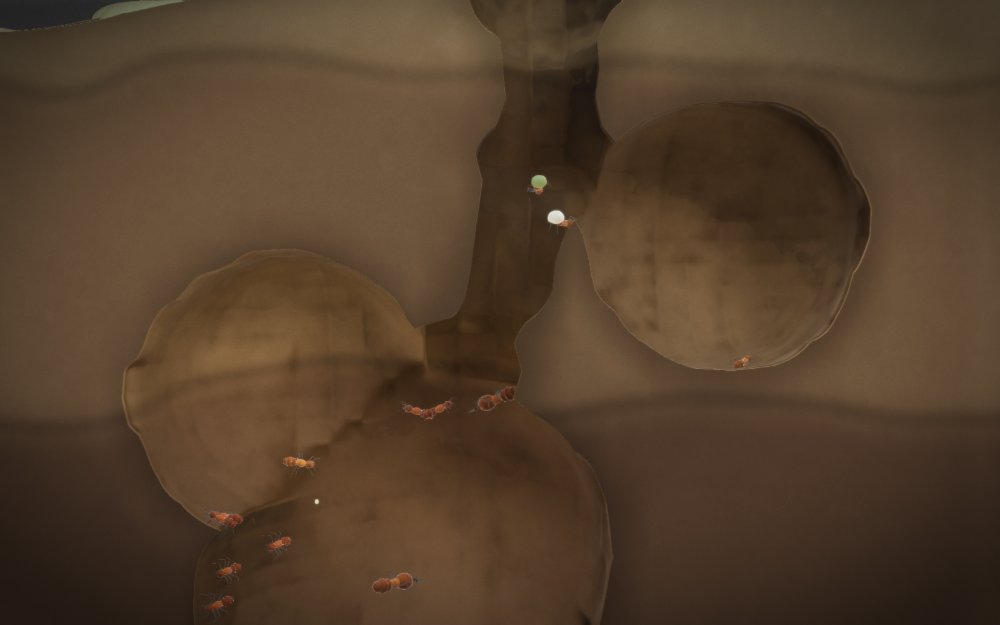
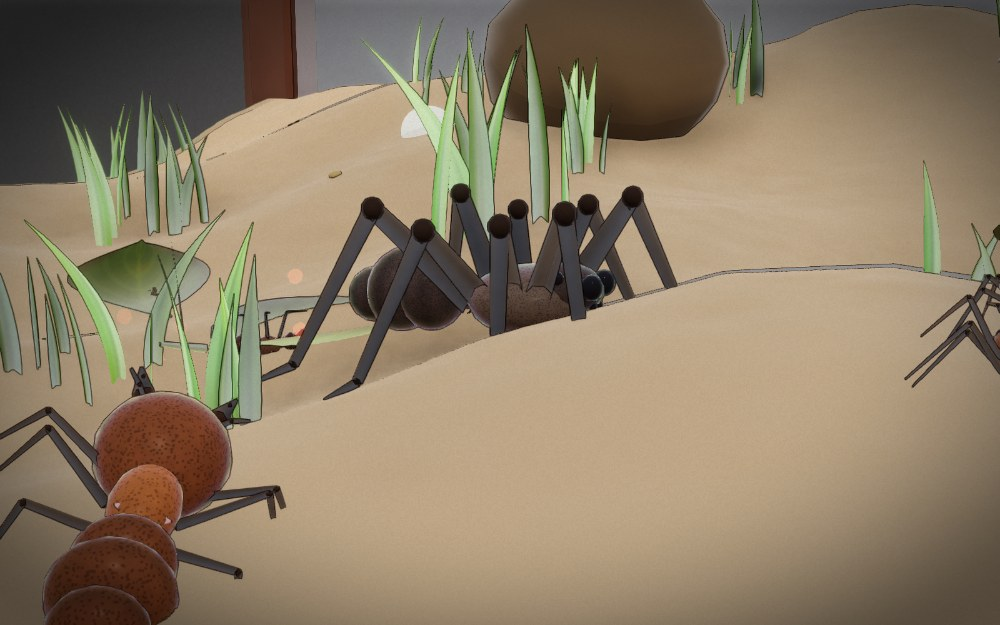
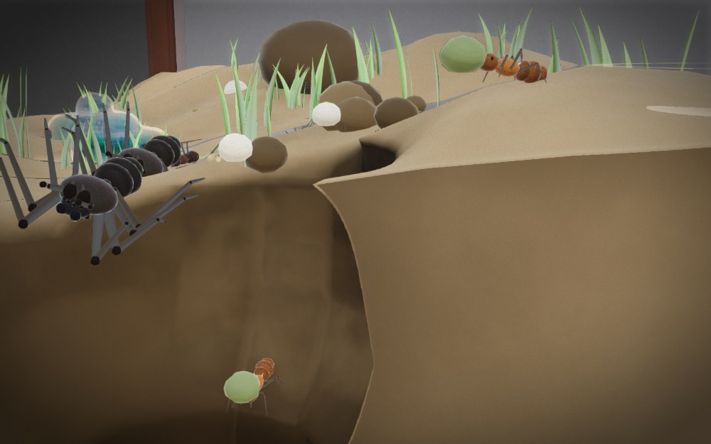
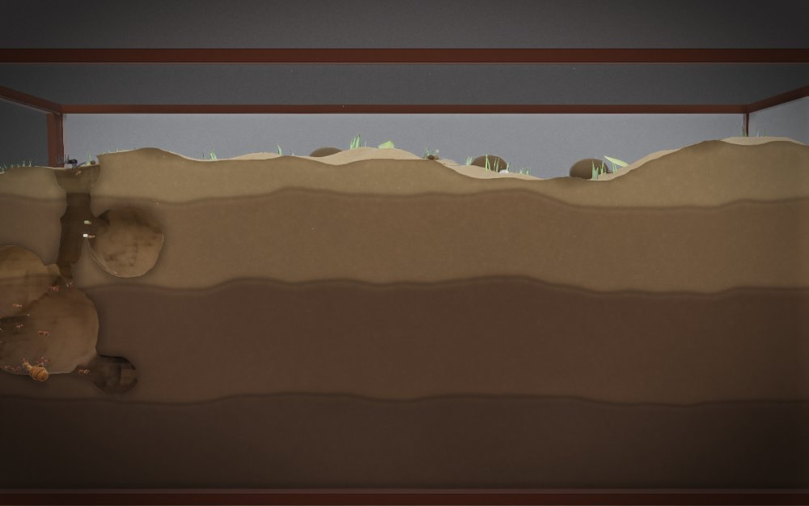

<div align="center">

# FORMICARIUM :: DEEP COLONY

**A cozy 3D ant-farm sim on a hand-written WebGL2 engine.**
No game engine, no libraries, no asset files — every mesh, texture, sound and
note of music is generated by code at load time.

[](https://winchxyz.github.io/ant-farm/)

[](https://developer.mozilla.org/docs/Web/API/WebGL2RenderingContext)


*One glass tank on a quiet desk. Dig it out, feed them, watch them thrive.*



</div>

---

## Play

**[▶ Open it in your browser](https://winchxyz.github.io/ant-farm/)** — nothing to install.

Or run it locally:

| | |
|---|---|
| **Windows** | double-click `play.bat` |
| **macOS / Linux** | `./play.sh` |
| **Any platform** | `node tools/serve.js`, then open <http://localhost:8137> |
| **No Node at all** | double-click `index.html` — classic scripts, zero network requests, runs off the filesystem |

Requires a browser with WebGL2 and hardware acceleration (Chrome, Edge, Firefox,
Safari 15+). Graphics quality runs LOW → ULTRA from the menu or `Esc` → Settings;
the renderer also scales its own resolution to hold framerate.

---

## Look at it

<table>
<tr>
<td width="50%"></td>
<td width="50%"></td>
</tr>
<tr>
<td><b>The nest in cross-section.</b> The colony digs in a thin slab pressed
against the front pane, so every tunnel is sliced open by the glass — exactly
like a real formicarium.</td>
<td><b>A wolf spider, hunting.</b> Drop one in and it picks a worker and stays
on it. Soldiers can bring it down, but not for free.</td>
</tr>
<tr>
<td></td>
<td></td>
</tr>
<tr>
<td><b>The mouth of the nest.</b> Sugar heaps where it lands, water runs
downhill and pools in hollows, and foragers carry both home a crumb at a time.</td>
<td><b>The whole tank.</b> Soil strata, terrain and grass above, and the colony
working its way down through it.</td>
</tr>
</table>

---

## The game

You are the colony, not a commander. You do not order one ant to carry one
crumb — you dig the rooms, decide who gets raised, and the swarm sorts out the
rest.

**The loop.** Your queen lays eggs. They hatch into whichever caste you queued.
Foragers stream out of the entrance, find food on the surface and haul it home.
Workers excavate the rooms you mark — and excavating *hands most of the dirt
back*, so you can nearly always afford the next one.

**Feeding them yourself.** The **FEED** row lets you tip sugar or water straight
into the tank. Grains are real physics bodies while they fall: they collide with
the terrain, bounce, roll down slopes and settle. Sugar heaps up where it lands;
water runs downhill and merges into puddles, so it gathers in hollows. The
moment a grain stops moving it becomes ordinary food — foragers walk over and
carry your sugar away one crumb at a time.

**Two resources.**

| | | |
|---|---|---|
| ◆ | **Food** | Everything edible, pooled. Foragers bring it in; new ants and daily upkeep spend it. |
| ▤ | **Dirt** | Loose soil. Digging spends it, and digging returns it. |

**The far nest.** On **Calm** — the default — there is no rival at all: the tank
is yours, and nothing but losing your queen can end the run. Pick **Gentle** or
**Lively** and a second colony digs in at the far end, visible through the same
glass, and eventually sends raiding parties at you.

> **Balance note.** Calm is the tuned mode: a colony left completely alone grows
> to roughly 90 ants and holds there. Gentle and Lively still overrun a player
> who never raises a single soldier — if you pick those, queue soldiers.

**Winning and losing.** There is no failure state except letting your queen die.
Wiping out the far nest ends the run in your favour, but nothing forces you to
try. The colony ticks along whether you act or not.

### Ants

| | Caste | Role | Food |
|---|---|---|---|
| W | Worker | Digs rooms, hauls dirt and food. | 15 |
| F | Forager | Fast, ranges the surface for food. | 17 |
| S | Soldier | Heavy chitin and big mandibles. | 32 |
| Q | Queen | Lays every egg. Keep her alive. | — |

### Rooms

| | Room | Effect |
|---|---|---|
| `/` | Tunnel | A plain passage. Cheap; every room needs one to reach it. |
| `●` | Nursery | Eggs hatch faster. Dig one early. |
| `▲` | Pantry | More food storage, and it keeps longer. |
| `▼` | Waste Pit | Somewhere for the rubbish. Keeps the nest clean. |
| `⚔` | Guard Post | Soldiers stationed here hit harder and muster faster. |

### Species

Six to choose from, each with a passive that colours the run: **Wood Ant**
(formic acid), **Leafcutter** (fungus economy), **Army Ant** (raiding),
**Carpenter** (armour), **Fire Ant** (fecundity and venom), **Harvester**
(storage, no spoilage). The tank itself is always Garden Loam.

### The bestiary

You can drop other animals into the tank and watch what the colony makes of
them. Prey is protein on legs; the hunters are a decision you have to live with.

| | Animal | Temper | Meat | What it does |
|---|---|---|---|---|
| `◐` | Woodlouse | flees | 120 | Slow and armoured. It curls up, and curled it takes a while to open. The safest way to feed a young colony a lot of protein at once. |
| `⤴` | Cricket | flees | 150 | Bolts the moment it is touched and outruns a worker. It takes a crowd to corner one. |
| `⬬` | Ground Beetle | ignores you | 260 | Walks past your ants and straight to the sugar. Hard to kill, and it will strip a heap while the colony works out what to do. |
| `✹` | Wolf Spider | hunts | 300 | Picks one worker and stays on it until it is dead. Soldiers can bring one down, but not for free. |
| `〰` | Centipede | hunts | 420 | Fast, venomous, and it does not stop. Do not put one in a tank you have not garrisoned. |

A dead animal is not a pickup — it is a **carcass**, a large lump of protein
lying where it fell. Workers walk over, take a piece each and carry it down into
the nest, and the body visibly shrinks and sinks as they strip it. Each species
also has its own death pose: a beetle ends up on its back, a spider's legs curl
under it, a woodlouse dies balled up on its side.

Your own dead are handled differently. A body in the nest is a disease vector,
so undertakers carry it — visibly, in their jaws — to the waste pit, which is
what repays the hygiene the death cost you.

### The shovel

Besides marking rooms for the colony to dig, you can cut the soil yourself. Hold
the shovel over the terrain and it carves the field directly. If your excavation
breaks into a tunnel the ants were using, they will come and wall it back up.

---

## Controls

The camera never inverts. Panning moves the world with your cursor; orbiting
flies the camera the way you drag; zoom pulls toward whatever you point at.
Invert X, invert Y and zoom-to-cursor live in `Esc` → Settings.

### Camera
| | |
|---|---|
| `Wheel` | Zoom toward the cursor |
| `Right-drag` | Orbit |
| `Middle-drag` | Pan — or hold `Space` and drag |
| `W A S D` | Move · `Shift` to sprint |
| `Q` `E` | Rotate · `R` `V` tilt |
| `G` | Frame the whole tank · `H` jump to the queen |
| `F` | Frame the selection · `X` ride the selected ant |

The eye is kept out of packed soil, so you cannot bury the camera and end up
staring through the world.

### Playing
| | |
|---|---|
| `1`…`5` | Pick a room to dig, then click the soil |
| `Shift` while placing | Keep placing the same room |
| `Left click` | Select · drag a box · `Shift` adds |
| `Double click` an ant | Select every ant like it |
| `Right click` | Send the selection somewhere |
| `Delete` | Cancel the dig under the cursor (refunds it) |
| `Ctrl`+`A` | Select the whole colony |
| `Esc` | Cancel, then Settings |

Raising ants is the bottom row: click for one, `Shift`-click for five,
right-click to cancel one from the queue.

### Time and view
| | |
|---|---|
| `Space` | Pause · `[` `]` change speed |
| `M` | Scent-trail glow on/off |
| `C` | Hide the glass for a clean look |
| `F1` or `?` | Field manual |

---

## How it is built

Everything below is written from scratch in this repository.

**Volumetric soil.** The signature effect. The earth is a signed distance field
baked on the GPU into a 3D texture (96×60×56), then raymarched per pixel in the
fragment shader, writing true `gl_FragDepth` so ants composite into it correctly.
Tunnels and chambers are capsules subtracted from the slab. When ants dig, the
field is re-baked, so excavation is visible in real time.

Because the nest is dug in a thin slab pressed against the front pane, every
tunnel is sliced open by the glass, exactly like a real formicarium.

The CPU keeps a twin of that field (`Farm.soilSDF`) used for camera collision,
and the terrain height function is shared byte-for-byte between JS and GLSL — if
those two ever disagree, everything placed on the surface floats or sinks.

**Storybook shading.** The look is deliberately drawn rather than photographed.
Direct light is quantised into three soft bands and speculars are cut to a fifth;
the soil is painted flat — a few wide colour strata with a wobbly boundary,
stepped brush patches, and small pebbles gathered in clumps, with the fine grain
and micro-relief switched off so they cannot fight the linework. A Sobel pass
over the depth and normal buffers inks every silhouette and crease. Grain,
chromatic aberration, deep bokeh and heavy vignette are all off, because each of
them pulls back toward photoreal.

**Ants.** Procedurally generated meshes — head, alitrunk, petiole nodes, gaster
with segment ridges, six three-jointed legs, antennae, mandibles — in three LODs
and four body plans. Animated entirely in the vertex shader: a tripod gait driven
by a per-instance phase, waving antennae, snapping mandibles. Thousands render in
a handful of instanced draw calls.

Ants stand on the *surface* they are on: solved against the sphere floor of a
chamber, and placed at an angle around the tube wall in a tunnel, which is what
lets them climb the sides instead of sliding along the centreline.

**Flora.** Grass is a keeled, tapered, twisted blade — the fold is what makes it
read as grass rather than a flat card — scattered in tufts, with dry sheath,
saturated body and sun-bleached tip, plus scorch and rust that differ per blade.
Leaves are cupped and curled with a midrib, lateral veins and necrotic margins.

**Renderer.** Forward+ with an MRT G-buffer, 2048² shadow map with PCF and a
faded border, hemispheric IBL, up to 16 dynamic point lights, GGX specular,
chitin fresnel with iridescence, refractive premultiplied glass, and a post chain
of SSAO → bloom (6-level dual-filter) → bokeh depth of field → god rays → ACES
tonemap and grade → FXAA with contrast-adaptive sharpening. 23 shader programs,
all compiled at boot.

**Audio.** A WebAudio graph with no samples: a six-oscillator drone pad through
an LFO-swept filter, a generative aeolian motif that brightens with tension, a
heartbeat under threat, a feedback-delay reverb, and every effect synthesised
from oscillators and filtered noise.

**Water.** Position Based Fluids — density constraints solved over a spatial
hash, with vorticity confinement and XSPH viscosity — rendered in screen space
rather than as geometry: sphere impostors into a depth buffer, a bilateral blur
that smooths the surface without bleeding across silhouettes, normals
reconstructed from the blurred depth, a thickness pass for absorption, then a
refraction composite that writes true `gl_FragDepth` so the fluid sits correctly
against the soil. That is why a pour reads as water and not as a heap of beads.

**Sugar.** Granular material is a different problem, so it gets a different
solver: falling grains are rigid bodies with Coulomb friction against the soil,
and once they settle they are handed to a mass-conserving height field that
relaxes toward the angle of repose. A dry heap stands at one slope, a wet one
stands steeper because the grains cohere, and water dissolves sugar it touches.
Over a void the field drains, handing material back to live particles, so a heap
poured onto the nest mouth pours *into* the nest.

**Simulation.** Agents run a job market against a colony-level scheduler, path
with A* over the tunnel graph, and fall back on free steering over the analytic
heightfield when they surface. The rival colony runs a strategic brain with
economy, construction and raid planning.

### Layout

```
index.html          boot, HUD markup, script order
css/ui.css          the entire interface
src/math.js         vectors, matrices, noise, seeded RNG
src/gl.js           WebGL2 layer: programs, VAOs, FBOs, 3D textures
src/geometry.js     every mesh in the game, generated
src/geometry_bugs.js  woodlouse, cricket, beetle, centipede
src/shaders.js      scene GLSL
src/shaders_post.js post-processing GLSL
src/renderer.js     frame graph, instancing, SDF bake, post chain
src/world.js        the tank, biomes, tunnel graph, A*, soil SDF
src/sdf_cache.js    trilinear CPU mirror of the soil field, with gradients
src/ants.js         castes, agents, steering, jobs, combat
src/colony.js       resources, brood, job market
src/ai.js           the far nest's brain
src/creatures.js    the bestiary: behaviour, combat, carcasses
src/excavate.js     the player's shovel, and the colony's answer to it
src/fx.js           particles, decals, screen shake
src/particles.js    the particle systems themselves
src/audio.js        procedural score and effects
src/input.js        raw input and the camera rig
src/game.js         world generation, simulation, actions
src/grains.js       pouring sugar and water, grain physics
src/heap.js         sugar as a height field: repose, dissolve, drain
src/heap_render.js  the sugar surface mesh
src/water_render.js screen-space fluid: depth blur, normals, refraction
src/render_scene.js culling, instance assembly, draw order
src/player.js       picking, selection, orders, construction
src/ui.js           menu, boot, and the in-game HUD
src/save.js         localStorage persistence
src/main.js         boot and frame loop
tools/serve.js      dev/static server
```

---

## Development

Two headless checks run without a GPU:

```bash
node tools/check.js       # builds every procedural mesh on the CPU:
                          # NaN, index range, attribute-count consistency
node tools/glsl_lint.js   # GLSL ES 3.00: balance, main(), unbound identifiers
```

`tools/serve.js <port> --dev` additionally serves `tools/harness.js` and a
`/__shot` endpoint. Loading the page with `?shot` enables `preserveDrawingBuffer`
and lets an automated client boot the game, step frames deterministically, park
the camera, capture the framebuffer to `tools/shots/`, and probe world state —
which is how the ground, camera and flora work above was verified.

---

## Notes

Saves live in `localStorage` under `formicarium.deepcolony.v1` — one slot, via
`Esc` → Settings.

Nothing in the game is on a timer. If you want to sit and watch foragers walk a
trail for ten minutes, that is a legitimate way to play it.
